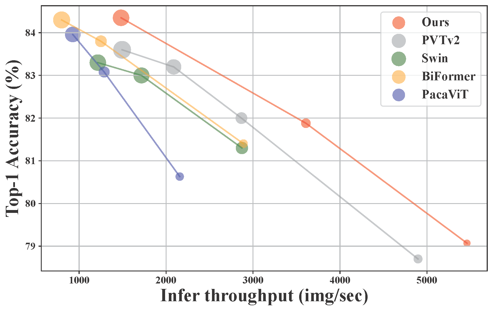
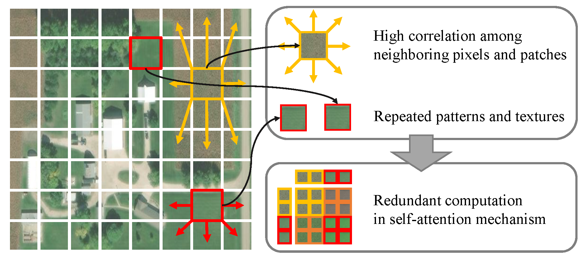
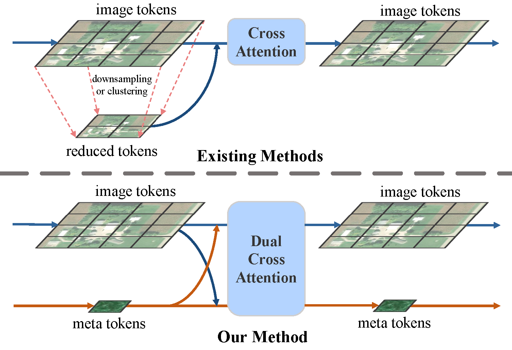
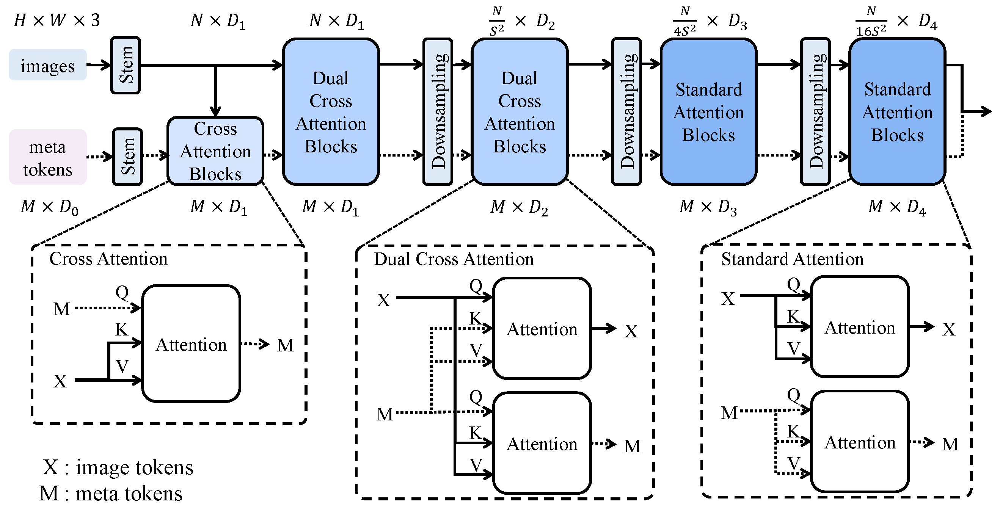
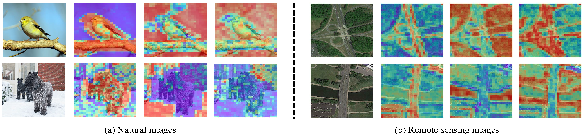

<h1 align="center"> LeMeViT: Efficient Vision Transformer with Learnable Meta Tokens for Remote
Sensing Image Interpretation <a href="">"></a> <a href="">"></a> </h1>
<p align="center">
<h4 align="center">The official repo for [IJCAI'24] <a href="https://arxiv.org/abs/2305.01443">LeMeViT: Efficient Vision Transformer with Learnable Meta Tokens for Remote
Sensing Image Interpretation</a>.</h4>
<h5 align="center"><em>Wentao Jiang, Jing Zhang, Di Wang, Zengmao Wang and Bo Du</em></h5>
<p align="center">
  <a href="#news">News</a> |
  <a href="#abstract">Abstract</a> |
  <a href="#method">Method</a> |
  <a href="#results">Results</a> |
  <a href="#usage">Usage</a> |
  <a href="#statement">Statement</a>
</p>

# News

***15/05/2024***  

- The paper is post on arxiv now! The code is released.

***17/04/2024***

- :tada: :tada: LeMeViT is accepted by IJCAI 2024! :tada: :tada:

***

Relevant Project: 

> :sparkles: **RSP: An Empirical Study of Remote Sensing Pretraining** | [Paper](https://arxiv.org/abs/2204.02825) | [Code](https://github.com/ViTAE-Transformer/RSP)
>
> :sparkles: **RVSA: Advancing Plain Vision Transformer Towards Remote Sensing Foundation Model** | [Paper](https://arxiv.org/abs/2208.03987) | [Code](https://github.com/ViTAE-Transformer/ViTAE-Transformer-Remote-Sensing)


# Comparison on ImageNet-1K

<figure align="center">

</figure>

Here's the comparison of LemeViT with other state-of-the-arts on ImageNet-1K, <i> i.e. </i> 
[**PVTv2**](), 
[**Swin Transformer**](), 
[**BiFormer**]() and 
[**PacaViT**]().

# Abstract

<p align="left"> Due to spatial redundancy in remote sensing images, sparse tokens containing rich information are usually involved in self-attention (SA) to reduce the overall token numbers within the calculation, avoiding the high computational cost issue in Vision Transformers. However, such methods usually obtain sparse tokens by hand-crafted or parallel-unfriendly designs, posing a challenge to reach a better balance between efficiency and performance. Different from them, this paper proposes to use learnable meta tokens to formulate sparse tokens, which effectively learn key information meanwhile improving the inference speed. Technically, the meta tokens are first initialized from image tokens via cross-attention. Then, we propose Dual Cross-Attention (DCA) to promote information exchange between image tokens and meta tokens, where they serve as query and key (value) tokens alternativelyin a dual-branch structure, significantly reducingthe computational complexity compared to self-attention. By employing DCA in the early stages with dense visual tokens, we obtain the hierarchical architecture LeMeViT with various sizes. Experimental results in classification and dense prediction tasks show that LeMeViT has a significant 1.7× speedup, fewer parameters, and competitive performance compared to the baseline models, and achieves a better trade-off between efficiency and performance.

# Motivation

<figure align="center">

<figcaption align = "left"> <b>Figure 1: </b> Due to the high correlation between neighboring pixels and image patches, as well as the repetitive nature of textures and patterns in remote sensing images, there is a significant amount of spatial redundancy. This results in redundant computation in self-attention mechanism. </figcaption>
</figure>

<figure align="center">

<figcaption align = "left"> <b>Figure 2: Existing methods </b> commonly use downsampling or clustering to reduce the number of image tokens within the current block which relies on strong priors or is parallel-computation unfriendly. <b> Our method </b> learns meta tokens to sparsely represent dense image tokens. Meta tokens exchange information with image tokens via the computationally efficient Dual Cross-Attention Block in an end-to-end way, promoting information flow stage-by-stage. </figcaption>
</figure>

# Method

<figure>

<figcaption align = "left"> <b>Figure 3: The Overall Architecture of LeMeViT.</b> LeMeViT consists of three different attention blocks, arranged from left to right as Cross Attention Block, Dual Cross-Attention Block, and Standard Attention Block. The meta tokens are first initialized from image tokens via cross-attention. Then, DCA is employed in the early stages to promote information exchange between image tokens and meta tokens, where they serve as query and key (value) tokens alternatively in a dual-branch structure. In the later stages, standard attention blocks based on self-attention are used. </figcaption>
</figure>

# Visualization

<figure>

<figcaption align = "left"> <b>Figure 4:</b> Visualization of the attention maps between three meta tokens in the last layer and image tokens. (a) illustrates the attention maps on natural images, and (b) illustrates attention maps on remote sensing images. </figcaption>
</figure>

# Results

> :alarm_clock: All the weights will be released soon.

### Classfication

|     Model     |  Resolution  | Throughput | Params |  MACs | Acc@1 | Weight |
|:-------------:|:------------:|:----------:|:------:|:-----:|:-----:|:------:|
|  LeMeViT-Tiny |   224 × 224  |   5316.58  |  8.64  |  1.68 | 79.07 |    -   |
| LeMeViT-Small |   224 × 224  |   3608.12  |  16.40 |  3.74 | 81.88 |    -   |
|  LeMeViT-Base |   224 × 224  |   1482.70  |  53.10 | 11.06 | 84.35 |    -   |

### Scene Recognition

|     Model     | Resolution | Throughput | Params |  MACs | Acc@1 | Weight |
|:-------------:|:----------:|:----------:|:------:|:-----:|:-----:|:------:|
|  LeMeViT-Tiny |   224 224  |   5327.47  |  8.33  |  1.78 | 98.80 |    -   |
| LeMeViT-Small |   224 224  |   3612.68  |  16.04 |  3.74 | 99.00 |    -   |
|  LeMeViT-Base |   224 224  |   1484.09  |  52.61 | 11.06 | 99.17 |    -   |

### Object Detection

|    Backbone   | Method         | Params |  MACs  |  mAP  | Weight |
|:-------------:|----------------|:------:|:------:|:-----:|:------:|
|  LeMeViT-Tiny | Oriented R-CNN |  25.37 | 154.12 | 76.63 |    -   |
| LeMeViT-Small | Oriented R-CNN |  33.15 | 193.91 | 77.58 |    -   |
|  LeMeViT-Base | Oriented R-CNN |  69.76 | 335.53 | 78.00 |    -   |

### Semantic Segmentation

|    Backbone   | Method  | Params |  MACs  |   OA  | mF1   | Weight |
|:-------------:|---------|:------:|:------:|:-----:|:-----:|:------:|
|  LeMeViT-Tiny | UperNet |  37.05 | 217.88 | 91.03 | 90.55 |    -   |
| LeMeViT-Small | UperNet |  45.59 | 228.16 | 91.23 | 90.62 |    -   |
|  LeMeViT-Base | UperNet |  83.19 | 263.75 | 91.35 | 90.85 |    -   |

### Change Detection

|    Backbone   | Method | Params |  MACs | F1 score | Weight |
|:-------------:|:------:|:------:|:-----:|:--------:|:------:|
|  LeMeViT-Tiny |   BIT  |  8.56  |  5.75 |   95.56  |    -   |
| LeMeViT-Small |   BIT  |  16.75 | 10.71 |   96.64  |    -   |
|  LeMeViT-Base |   BIT  |  53.34 | 28.47 |   97.32  |    -   |

# Usage

The script examples can be found in the directory [scripts](scripts), which can be modified and run easily.

Such as:

```
# For classification & scene recognition training
bash scripts/train.sh

# For semantic segmentation evaluation
bash scripts/test_ss.sh 
```
## Preparation
<details>

<summary>Datasets</summary>

- Classification: [ImageNet-1k](https://image-net.org/)
- Scene Recognition: [MillionAid](https://captain-whu.github.io/DiRS/)
- Object Detection: [DOTA-v1.0](https://captain-whu.github.io/DOTA/index.html)
- Semantic Segmentation: [Potsdam](https://www.isprs.org/education/benchmarks/UrbanSemLab/2d-sem-label-potsdam.aspx)
- Change Detection: [CDD](https://drive.google.com/file/d/1GX656JqqOyBi_Ef0w65kDGVto-nHrNs9/edit)
  
</details>


## Classification & Scene Recognition

### Installation

**Environment:** Python=3.8, Pytorch=2.1.0, CUDA=12.2

First, install the necessary libraries.

```
pip install timm=0.9.16
pip install einops
```

Then, optionally install the following libraries for further acceleration.

```
# Speed: flash_attn > xformers > torch

pip install flash_attn
pip install xformers
```


### Evaluation

For ImageNet-1K classification, the evaluation script can be:
```
  python \
    validate.py \
    --data-dir <data_path> \
    --dataset imagenet \
    --model lemevit_small \
    --num-classes 1000 \
    --checkpoint <ckpt_path> \
    --img-size 224 \
    --batch-size <batch_size> \
    --amp \
```

For MillionAid scene recognition, the evaluation script can be:
```
  python \
    validate.py \
    --data-dir <data_path> \
    --dataset millionaid \
    --model lemevit_small \
    --num-classes 51 \
    --checkpoint <ckpt_path> \
    --img-size 224 \
    --batch-size <batch_size> \
    --amp \
```

Also, you can follow script [test.sh](scripts/test.sh) for recommended usage.

### Training

The training script for both classication and scene recognition can be:

```
OMP_NUM_THREADS=1 \
CUDA_VISIBLE_DEVICES=<devices_ids> \
  torchrun \
    --rdzv_backend c10d \
    --rdzv-endpoint=localhost:0 \
    --nnodes 1 \
    --nproc_per_node <devices_num> \
    main.py \
    --config <config_file_path> \
    --output <output_path> \
    --experiment <exp_name> \
    --model <model_name> \
    --img-size 224 \
    --batch-size <batch_size> \
```

Also, you can follow script [train.sh](scripts/train.sh) for recommended usage.


## Object Detection & Semantic Segmentation

### Installation

Since we use [OBBDetection](https://github.com/jbwang1997/OBBDetection) and [MMSegmenation](https://github.com/open-mmlab/mmsegmentation) to implement corresponding detection or segmentation models, we only provide necessary config and backbone files. 

The installation and dataset preparation can separately refer [OBBDetection-installation](https://github.com/jbwang1997/OBBDetection/blob/master/docs/install.md) and [MMSegmentation-installation](https://github.com/open-mmlab/mmsegmentation/blob/master/docs/en/get_started.md#installation)

Then put these files into corresponding folders.

### Evalation & Training

```
# For object detection evaluation
bash scripts/test_od.sh

# For object detection training
bash scripts/train_od.sh

# For semantic segmentation evaluation
bash scripts/test_ss.sh

# For semantic segmentation training
bash scripts/train_ss.sh
```

## Change Detection

### Installation


Please refer to [BIT-Readme.md](https://github.com/justchenhao/BIT_CD/blob/master/README.md) for installing.

### Evalation & Training

```
# For evaluation
bash scripts/test_cd.sh

# For training
bash scripts/train_cd.sh
```


# Statement

## Acknowledgement
This repository is built using the [timm](https://github.com/rwightman/pytorch-image-models) library.


## License
This project is for research purpose only. 

## Citation

If you find LeMeViT helpful, please consider giving this repo a star :star: and citing:

```
@inproceedings{jiang_lemevit_2024,
  title={LeMeViT: Efficient Vision Transformer with Learnable Meta Tokens for Remote Sensing Image Interpretation},
  author={Wentao Jiang, Jing Zhang, Di Wang, Zengmao Wang, Bo Du},
  booktitle={International Joint Conference on Artificial  Intelligence},
  year={2024}
}
```

For any other questions please contact [jiang_wentao@whu.edu.cn](mailto:jiang_wentao@whu.edu.cn).
